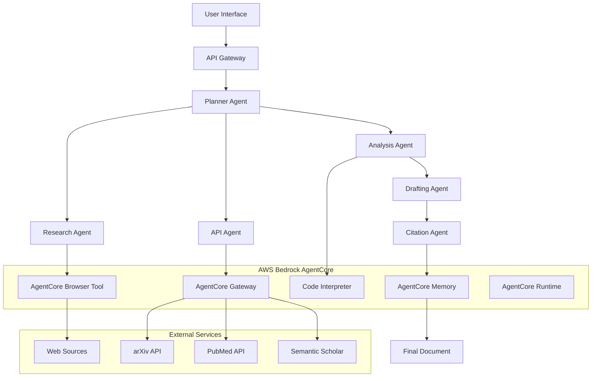

# Agent Scrivener Design Document

## Overview

Agent Scrivener is architected as a cloud-native, serverless multi-agent system that transforms research queries into comprehensive, cited documents. The system leverages AWS Bedrock AgentCore for orchestration and execution, with specialized agents coordinating through a graph-based workflow managed by the Strands SDK.

The architecture prioritizes scalability, reliability, and maintainability through clear separation of concerns, robust error handling, and comprehensive state management. Each agent operates independently while contributing to a cohesive research pipeline.

## Architecture

### High-Level System Architecture



### Agent Orchestration Flow

The system implements a directed acyclic graph (DAG) workflow where the Planner Agent decomposes research queries into specialized tasks:

1. **Query Analysis**: Planner Agent analyzes the research query and creates a task execution plan
2. **Parallel Information Gathering**: Research Agent and API Agent work concurrently to gather data
3. **Data Processing**: Analysis Agent processes raw information to extract insights
4. **Content Synthesis**: Drafting Agent creates coherent narrative from processed insights
5. **Citation Management**: Citation Agent ensures academic rigor and proper attribution
6. **Final Assembly**: System combines all components into the final research document

## Components and Interfaces

### Core Agent Classes

#### PlannerAgent
```python
class PlannerAgent:
    def __init__(self, bedrock_client: BedrockClient):
        self.client = bedrock_client
        self.strands_orchestrator = StrandsOrchestrator()
    
    async def create_research_plan(self, query: str) -> ResearchPlan:
        """Decomposes research query into executable task graph"""
        pass
    
    async def execute_plan(self, plan: ResearchPlan) -> ResearchSession:
        """Orchestrates execution of research tasks"""
        pass
```

#### ResearchAgent
```python
class ResearchAgent:
    def __init__(self, browser_tool: AgentCoreBrowserTool):
        self.browser = browser_tool
        self.nova_act = NovaActSDK()
    
    async def search_and_extract(self, query: str, max_sources: int = 10) -> List[ExtractedArticle]:
        """Performs web search and content extraction"""
        pass
    
    async def extract_content(self, url: str) -> ExtractedArticle:
        """Extracts clean content from a specific URL"""
        pass
```

#### APIAgent
```python
class APIAgent:
    def __init__(self, gateway: AgentCoreGateway):
        self.gateway = gateway
    
    async def search_academic_databases(self, query: str) -> List[AcademicPaper]:
        """Queries structured academic databases"""
        pass
    
    async def get_paper_details(self, paper_id: str, database: str) -> AcademicPaper:
        """Retrieves detailed information for specific papers"""
        pass
```

#### AnalysisAgent
```python
class AnalysisAgent:
    def __init__(self, code_interpreter: AgentCoreCodeInterpreter):
        self.interpreter = code_interpreter
    
    async def analyze_content(self, articles: List[ExtractedArticle]) -> AnalysisResults:
        """Performs NER, topic modeling, and statistical analysis"""
        pass
    
    async def generate_insights(self, analysis: AnalysisResults) -> List[Insight]:
        """Synthesizes analysis into structured insights"""
        pass
```

#### DraftingAgent
```python
class DraftingAgent:
    def __init__(self, bedrock_client: BedrockClient):
        self.client = bedrock_client
    
    async def generate_document_sections(self, insights: List[Insight]) -> DocumentSections:
        """Creates coherent prose from structured insights"""
        pass
    
    async def format_document(self, sections: DocumentSections) -> str:
        """Formats final document with proper Markdown structure"""
        pass
```

#### CitationAgent
```python
class CitationAgent:
    def __init__(self, memory: AgentCoreMemory):
        self.memory = memory
        self.citation_tracker = CitationTracker()
    
    async def track_sources(self, content: str, source: Source) -> None:
        """Tracks provenance of information"""
        pass
    
    async def generate_bibliography(self, citations: List[Citation]) -> str:
        """Formats citations in APA style"""
        pass
```

### Data Models

#### Core Data Structures
```python
from pydantic import BaseModel, HttpUrl
from typing import List, Optional, Dict, Any
from datetime import datetime

class Source(BaseModel):
    url: HttpUrl
    title: str
    author: Optional[str] = None
    publication_date: Optional[datetime] = None
    source_type: str  # "web", "academic", "database"

class ExtractedArticle(BaseModel):
    source: Source
    content: str
    key_findings: List[str]
    confidence_score: float
    extraction_timestamp: datetime

class AcademicPaper(BaseModel):
    title: str
    authors: List[str]
    abstract: str
    publication_year: int
    doi: Optional[str] = None
    database_source: str
    citation_count: Optional[int] = None

class Insight(BaseModel):
    topic: str
    summary: str
    supporting_evidence: List[str]
    confidence_score: float
    related_sources: List[Source]

class ResearchPlan(BaseModel):
    query: str
    task_graph: Dict[str, Any]
    estimated_duration: int  # minutes
    session_id: str

class DocumentSections(BaseModel):
    introduction: str
    methodology: str
    findings: str
    conclusion: str
    table_of_contents: str
```

### Integration Interfaces

#### AgentCore Tool Wrappers
```python
class BrowserToolWrapper:
    def __init__(self, browser_tool: AgentCoreBrowserTool):
        self.tool = browser_tool
        self.nova_act = NovaActSDK()
    
    async def navigate_and_extract(self, url: str) -> Dict[str, Any]:
        """Enhanced navigation with Nova Act precision"""
        pass

class GatewayWrapper:
    def __init__(self, gateway: AgentCoreGateway):
        self.gateway = gateway
    
    async def query_external_api(self, service: str, params: Dict[str, Any]) -> Dict[str, Any]:
        """Standardized external API access"""
        pass
```

## Error Handling

### Error Classification and Recovery Strategies

#### Network and API Errors
- **Timeout Errors**: Implement exponential backoff with jitter (base delay: 1s, max delay: 60s)
- **Rate Limiting**: Respect API rate limits with intelligent queuing and request spacing
- **Service Unavailability**: Graceful degradation with alternative data sources

#### Content Processing Errors
- **Extraction Failures**: Skip problematic sources and continue with available data
- **Analysis Errors**: Provide partial results with confidence indicators
- **Format Errors**: Apply default formatting with error annotations

#### Agent Communication Errors
- **Task Failures**: Isolate failed tasks and continue with successful ones
- **State Inconsistency**: Implement checkpointing and rollback mechanisms
- **Memory Errors**: Implement intelligent memory management with LRU eviction

### Error Handling Implementation
```python
class ErrorHandler:
    def __init__(self):
        self.retry_config = {
            'max_retries': 3,
            'base_delay': 1.0,
            'max_delay': 60.0,
            'backoff_factor': 2.0
        }
    
    async def with_retry(self, operation: Callable, error_types: tuple = (Exception,)):
        """Generic retry wrapper with exponential backoff"""
        pass
    
    def handle_agent_error(self, agent_name: str, error: Exception) -> ErrorResponse:
        """Centralized agent error handling"""
        pass
```

## Testing Strategy

### Unit Testing Approach

#### Agent Testing
- **Mock External Dependencies**: Use pytest fixtures to mock AgentCore tools
- **Test Agent Logic**: Verify each agent's core functionality independently
- **Data Validation**: Ensure all Pydantic models validate correctly

#### Integration Testing
- **Agent Communication**: Test inter-agent data flow and message passing
- **External Service Integration**: Test API wrappers with real service endpoints
- **End-to-End Workflows**: Validate complete research pipeline execution

#### Performance Testing
- **Load Testing**: Simulate concurrent research requests
- **Memory Usage**: Monitor agent memory consumption during long-running tasks
- **Response Time**: Measure end-to-end research completion times

### Testing Implementation Structure
```python
# tests/unit/test_research_agent.py
import pytest
from unittest.mock import AsyncMock, MagicMock
from agents.research_agent import ResearchAgent

@pytest.fixture
def mock_browser_tool():
    return AsyncMock()

@pytest.fixture
def research_agent(mock_browser_tool):
    return ResearchAgent(mock_browser_tool)

class TestResearchAgent:
    async def test_search_and_extract_success(self, research_agent, mock_browser_tool):
        # Test successful content extraction
        pass
    
    async def test_search_and_extract_with_failures(self, research_agent, mock_browser_tool):
        # Test graceful handling of extraction failures
        pass

# tests/integration/test_agent_orchestration.py
class TestAgentOrchestration:
    async def test_full_research_pipeline(self):
        # Test complete research workflow
        pass
    
    async def test_partial_failure_recovery(self):
        # Test system behavior with partial agent failures
        pass
```

### Continuous Integration Pipeline
- **Pre-commit Hooks**: Run linting, type checking, and basic tests
- **Automated Testing**: Execute full test suite on every commit
- **Performance Benchmarks**: Track system performance over time
- **Security Scanning**: Validate dependencies and code for security issues

## Deployment Architecture

### AWS Infrastructure Components

#### AgentCore Runtime Configuration
- **Memory Allocation**: 2GB per agent instance for optimal performance
- **Timeout Settings**: 8-hour maximum for long-running research tasks
- **Concurrency**: Support for 10 concurrent research sessions per deployment
- **Auto-scaling**: Scale based on queue depth and response time metrics

#### Security and Access Control
- **IAM Roles**: Least-privilege access for each agent type
- **API Gateway**: Rate limiting and authentication for external access
- **VPC Configuration**: Secure network isolation for sensitive research data
- **Encryption**: End-to-end encryption for all data in transit and at rest

#### Monitoring and Observability
- **CloudWatch Metrics**: Track agent performance, error rates, and resource usage
- **Distributed Tracing**: Monitor request flow across agent boundaries
- **Alerting**: Proactive notifications for system health issues
- **Logging**: Structured logging for debugging and audit trails

This design provides a robust foundation for implementing Agent Scrivener using Kiro's spec-driven development methodology, ensuring that each component is well-defined, testable, and maintainable.