<div align="center">

# Agent Scrivener

### The Autonomous Research and Content Synthesis Platform

**From research queries to comprehensive, cited documents in seconds.**

[](https://github.com/Keerthivasan-Venkitajalam/agent-scrivener)
[](LICENSE)
[](https://python.org)
[](https://modelcontextprotocol.io)

[About](#about-the-project) • [Tech Stack](#tech-stack) • [Architecture](#system-architecture) • [Getting Started](#getting-started) • [Kiro Integration](#integration-with-kiro-and-agentic-ides)

</div>

---

## About the Project

**Agent Scrivener** is an AI-first **Multi-Agent Research Platform** that transforms natural language queries into comprehensive, fully-cited research documents. Unlike traditional research tools that require manual coordination, Agent Scrivener employs autonomous specialized agents that actively explore, analyze, and synthesize information from diverse sources in real-time.

By combining **Multi-Agent Orchestration**, the **Model Context Protocol (MCP)**, and **AWS Bedrock AgentCore**, Agent Scrivener bridges the gap between research intent and execution. It manages the entire research lifecycle—from web scraping and academic database queries to content analysis and citation management—autonomously coordinating agents, processing data, and generating professional documents directly in your workflow.

### Key Transformations

- **Manual to Autonomous**: No more juggling multiple research tools. Describe your research need, and the agents orchestrate the entire workflow.
- **Scattered to Synthesized**: Agents don't just collect information; they analyze, cross-reference, and synthesize insights from web sources and academic databases.
- **Static to Integrated**: Through MCP servers, research capabilities integrate seamlessly into your IDE, making research a natural part of your development workflow.

---

## How We Integrate with Kiro

Agent Scrivener is designed for seamless integration with agentic IDEs through the **Model Context Protocol (MCP)**. We provide three specialized MCP servers that transform your IDE into a research powerhouse.

### 1. As Research Tool Providers (The MCP Servers)

We expose high-level **MCP Tools** that any compatible IDE can invoke:

- **Citation Formatter Server**: Format citations in APA, MLA, Chicago, or Harvard styles with automatic DOI validation
- **Web Research Server**: Search the web, extract content, and retrieve metadata from any URL
- **Academic Search Server**: Query 10+ academic databases including arXiv, PubMed, Google Scholar, OpenAlex, and CORE

### 2. For Seamless IDE Integration (The Protocol)

MCP provides a standardized interface between Agent Scrivener and your IDE:

- **What it solves**: Usually, research tools are isolated from your development environment
- **How it works**: Our MCP servers expose research capabilities through a standard protocol. Your IDE uses these tools as if they were native features

### 3. To Enable Autonomous Research (The Agents)

Behind the MCP interface, specialized agents coordinate to deliver results:

- **Planner Agent**: Analyzes queries and orchestrates the research workflow
- **Research Agent**: Autonomously browses and extracts web content
- **API Agent**: Queries academic databases and retrieves papers
- **Analysis Agent**: Processes data and generates insights
- **Citation Agent**: Tracks sources and formats bibliographies

---

## System Architecture

Agent Scrivener follows a **Multi-Agent Orchestration** architecture where specialized agents coordinate through a central orchestrator.

```mermaid
graph TB
    User[👤 Researcher] -->|Natural Language Query| Orchestrator[🧠 Agent Orchestrator]
    
    subgraph "🤖 Specialized Agents"
        Orchestrator -->|Coordinate| Planner[📋 Planner Agent]
        Orchestrator -->|Coordinate| Research[🔍 Research Agent]
        Orchestrator -->|Coordinate| API[📚 API Agent]
        Orchestrator -->|Coordinate| Analysis[📊 Analysis Agent]
        Orchestrator -->|Coordinate| Draft[✍️ Drafting Agent]
        Orchestrator -->|Coordinate| Citation[📖 Citation Agent]
    end
    
    subgraph "🔌 MCP Integration Layer"
        Research -->|Expose| WebMCP[Web Research Server]
        API -->|Expose| AcademicMCP[Academic Search Server]
        Citation -->|Expose| CitationMCP[Citation Formatter Server]
    end
    
    subgraph "🎯 External Services"
        Research -->|Query| Web[Web Sources]
        API -->|Query| Databases[Academic Databases]
        Analysis -->|Process| NLP[NLP Pipeline]
    end
    
    subgraph "💾 Data Layer"
        Orchestrator -->|Store| Memory[Session Memory]
        Orchestrator -->|Persist| Storage[Document Storage]
    end
    
    subgraph "🖥️ IDE Integration"
        WebMCP -->|MCP Protocol| IDE[Kiro / Any MCP IDE]
        AcademicMCP -->|MCP Protocol| IDE
        CitationMCP -->|MCP Protocol| IDE
    end
    
    Draft -->|Generate| Document[📄 Research Document]
    
    classDef agent fill:#7c3aed,stroke:#5b21b6,stroke-width:2px,color:#fff;
    classDef mcp fill:#0ea5e9,stroke:#0369a1,stroke-width:2px,color:#fff;
    classDef external fill:#059669,stroke:#047857,stroke-width:2px,color:#fff;
    
    class Orchestrator,Planner,Research,API,Analysis,Draft,Citation agent;
    class WebMCP,AcademicMCP,CitationMCP mcp;
    class Web,Databases,NLP external;
```



---

## Tech Stack

**Agent Scrivener is built on a modern, production-ready stack:**

### Core Intelligence
- **Agent Framework**: AWS Bedrock AgentCore Runtime
- **Integration Protocol**: Model Context Protocol (MCP)
- **LLMs**: AWS Bedrock (Claude, Titan models)
- **NLP Processing**: spaCy, NLTK for content analysis

### Backend & API
- **Framework**: FastAPI (async/await support)
- **Language**: Python 3.9+ with type hints
- **Data Validation**: Pydantic v2
- **WebSocket**: Real-time progress updates

### Research Capabilities
- **Web Scraping**: BeautifulSoup4, Playwright
- **Academic APIs**: arXiv, PubMed, Semantic Scholar, OpenAlex, CORE
- **Citation Management**: CrossRef API integration
- **Search**: DuckDuckGo API

### Infrastructure
- **Cloud Platform**: AWS (Lambda, S3, DynamoDB)
- **Deployment**: Serverless Framework
- **Testing**: pytest with comprehensive coverage
- **Validation**: Production readiness validation framework

---

## Integration with Kiro and Agentic IDEs

### Kiro IDE Integration

Agent Scrivener provides native integration with Kiro through MCP servers. To integrate with Kiro:

1. **Configure the MCP servers** in your Kiro settings file (`.kiro/settings/mcp.json`):

```json
{
  "mcpServers": {
    "citation-formatter": {
      "command": "python",
      "args": ["/path/to/agent-scrivener/mcp_servers/citation_formatter_server.py"],
      "disabled": false,
      "autoApprove": ["format_citation", "validate_doi"]
    },
    "web-research": {
      "command": "python",
      "args": ["/path/to/agent-scrivener/mcp_servers/web_research_server.py"],
      "disabled": false,
      "autoApprove": ["search_web", "extract_content"]
    },
    "academic-search": {
      "command": "uvx",
      "args": ["mcp-server-academic-search"],
      "disabled": false,
      "autoApprove": ["search_arxiv", "search_pubmed"]
    }
  }
}
```

2. **Restart Kiro** or reconnect the MCP servers from the MCP Server view in the Kiro feature panel.

3. **Start researching** - The tools are now available in your Kiro workspace for:
   - Formatting citations in multiple styles
   - Searching academic databases
   - Extracting web content
   - Validating DOIs and retrieving paper metadata

### Generic Agentic IDE Integration

Agent Scrivener follows the Model Context Protocol (MCP) specification, making it compatible with any MCP-enabled IDE:

1. Locate your IDE's MCP configuration file
2. Add the Agent Scrivener MCP servers using the configuration format above
3. Adjust the `command` and `args` fields to match your IDE's requirements
4. Restart your IDE or reload the MCP configuration

### Available MCP Tools

Once integrated, your IDE will have access to:

**Citation Formatter Tools:**
- `format_citation`: Format citations in APA, MLA, Chicago, or Harvard style
- `validate_doi`: Validate DOIs and retrieve metadata from CrossRef
- `generate_bibliography`: Generate formatted bibliographies from multiple citations

**Web Research Tools:**
- `search_web`: Search the web using DuckDuckGo
- `extract_content`: Extract main content from web pages
- `get_page_metadata`: Retrieve metadata from URLs

**Academic Search Tools:**
- `search_arxiv`, `search_pubmed`, `search_google_scholar`: Search major academic databases
- `search_openalex`, `search_core`, `search_semantic`: Access comprehensive research indexes
- `search_biorxiv`, `search_medrxiv`, `search_iacr`: Specialized preprint servers
- `get_paper_by_doi`: Retrieve papers by DOI
- `search_authors`, `get_author_papers`: Find authors and their publications
- `get_openalex_citations`, `get_openalex_references`: Explore citation networks
- `download_paper`, `read_paper`: Download and extract text from PDFs

---

## Getting Started

### Prerequisites

- **Python** 3.9 or higher
- **pip** or **uv** package manager
- **AWS Account** with Bedrock access (for production deployment)
- API Keys for:
  - **AWS_ACCESS_KEY_ID** and **AWS_SECRET_ACCESS_KEY**: For AWS Bedrock
  - Optional: Academic database API keys for enhanced access

### Installation

1. **Clone the repository**:
```bash
git clone https://github.com/Keerthivasan-Venkitajalam/agent-scrivener.git
cd agent-scrivener
```

2. **Create and activate a virtual environment**:
```bash
python -m venv venv
source venv/bin/activate  # On Windows: venv\Scripts\activate
```

3. **Install dependencies**:
```bash
pip install -r requirements.txt
```

4. **Install the package in development mode**:
```bash
pip install -e .
```

5. **Install MCP server dependencies**:
```bash
cd mcp_servers
pip install -r requirements.txt
cd ..
```

### Configuration

Create a `config.json` file in the project root:

```json
{
  "debug": false,
  "log_level": "INFO",
  "max_concurrent_sessions": 10,
  "agentcore": {
    "region": "us-east-1",
    "timeout_seconds": 300
  },
  "processing": {
    "max_sources_per_query": 20,
    "confidence_threshold": 0.7
  }
}
```

Or use environment variables:

```bash
export AWS_REGION=us-east-1
export DEBUG=false
export LOG_LEVEL=INFO
export MAX_CONCURRENT_SESSIONS=10
```

### Running the Application

**Start the FastAPI server**:
```bash
uvicorn agent_scrivener.api.main:app --host 0.0.0.0 --port 8000
```

**Run MCP servers individually** (for testing):
```bash
# Citation formatter server
python mcp_servers/citation_formatter_server.py

# Web research server
python mcp_servers/web_research_server.py
```

**Submit a research request**:
```bash
curl -X POST "http://localhost:8000/research" \
  -H "Content-Type: application/json" \
  -d '{"query": "Latest developments in quantum computing"}'
```

---

## Project Structure

```text
agent_scrivener/
├── agents/                    # Agent implementations
│   ├── planner_agent.py      # Query analysis and orchestration
│   ├── research_agent.py     # Web research and extraction
│   ├── api_agent.py          # Academic database queries
│   ├── analysis_agent.py     # Data processing and insights
│   ├── drafting_agent.py     # Content synthesis
│   └── citation_agent.py     # Citation management
├── models/                    # Pydantic v2 data models
│   ├── core.py               # Core data structures
│   └── analysis.py           # Analysis models
├── tools/                     # AgentCore tool wrappers
│   ├── browser_wrapper.py    # Web browsing tools
│   ├── code_interpreter_wrapper.py
│   └── gateway_wrapper.py    # API gateway tools
├── utils/                     # Common utilities
│   ├── config.py             # Configuration management
│   ├── logging.py            # Logging setup
│   └── monitoring.py         # Performance monitoring
├── deployment/
│   └── validation/           # Production readiness validation
│       ├── orchestrator.py   # Validation orchestrator
│       ├── cli.py            # CLI interface
│       └── validators/       # Individual validators
├── api/                      # FastAPI application
│   ├── main.py              # API entry point
│   ├── models.py            # API request/response models
│   ├── websocket.py         # WebSocket support
│   └── routes.py            # API endpoints
├── mcp_servers/              # Model Context Protocol servers
│   ├── citation_formatter_server.py
│   ├── web_research_server.py
│   └── README.md
├── tests/
│   ├── unit/                # Unit tests
│   ├── integration/         # Integration tests
│   ├── validation/          # Validation framework tests
│   └── performance/         # Performance benchmarks
└── docs/                    # Documentation
    ├── validation_guide.md
    └── validation_development.md
```

---

## Development

### Running Tests

```bash
# Run all tests
pytest

# Run with coverage
pytest --cov=agent_scrivener --cov-report=html

# Run specific test categories
pytest tests/unit/
pytest tests/integration/
pytest tests/validation/
```

### Code Quality

```bash
# Format code
black agent_scrivener/
isort agent_scrivener/

# Type checking
mypy agent_scrivener/

# Linting
flake8 agent_scrivener/
```

### Production Validation

Before deploying, run the comprehensive validation suite:

```bash
python -m agent_scrivener.deployment.validation.cli validate-all
```

This validates:
- API endpoints and response formats
- Security configurations
- Data persistence mechanisms
- AWS infrastructure setup
- Monitoring and observability
- Documentation completeness
- Performance benchmarks
- End-to-end workflows

---

## Deployment

### AWS AgentCore Runtime

The system is designed for deployment on AWS Bedrock AgentCore Runtime:

```bash
# Deploy to AWS
cd deployment/
serverless deploy --stage production
```

### Docker

Build and run with Docker:

```bash
docker build -t agent-scrivener .
docker run -p 8000:8000 agent-scrivener
```

### MCP Server Deployment

For production MCP server deployment:

1. Run servers as system services (systemd, supervisor)
2. Implement proper logging and monitoring
3. Set up health checks
4. Configure appropriate timeouts
5. Secure inter-process communication

---

## Advanced Use Cases

### 1. Comprehensive Literature Review

**Scenario:** *"Conduct a literature review on transformer architectures in NLP, focusing on papers from 2020-2024."*

**The Agentic Loop:**
1. **Planning**: Planner Agent breaks down the query into subtasks
2. **Search**: API Agent queries arXiv, Semantic Scholar, and Google Scholar
3. **Analysis**: Analysis Agent identifies key themes and trends
4. **Synthesis**: Drafting Agent creates a structured review
5. **Citation**: Citation Agent formats all references in APA style

### 2. Cross-Domain Research Synthesis

**Scenario:** *"How are machine learning techniques being applied in climate science? Include both academic papers and recent industry developments."*

**The Agentic Loop:**
1. **Discovery**: Research Agent scrapes relevant blogs and news
2. **Academic Search**: API Agent queries environmental and CS databases
3. **Cross-Reference**: Analysis Agent identifies connections between sources
4. **Integration**: Drafting Agent synthesizes insights from both domains
5. **Validation**: Citation Agent ensures all claims are properly sourced

### 3. Real-Time Research Updates

**Scenario:** *"Monitor new papers on quantum computing and notify me of significant developments."*

**The Agentic Loop:**
1. **Monitoring**: API Agent sets up periodic queries to academic databases
2. **Filtering**: Analysis Agent identifies papers matching significance criteria
3. **Summarization**: Drafting Agent creates concise summaries
4. **Notification**: System sends updates via WebSocket or email

---

## Troubleshooting

| Issue | Solution |
| :--- | :--- |
| **"MCP server not connecting"** | Ensure the server path is correct and Python environment is activated. Check logs in the MCP server output. |
| **"API rate limit exceeded"** | Academic APIs have rate limits. The system automatically throttles requests. Wait a few minutes and retry. |
| **"Citation format incorrect"** | Verify the citation style parameter (apa, mla, chicago, harvard) is correctly specified. |
| **"WebSocket connection failed"** | Check that the FastAPI server is running and the port (8000) is not blocked by firewall. |

---

## Contributing

Contributions are welcome! Whether you're fixing bugs, adding new agents, improving MCP tools, or enhancing documentation, your help is appreciated.

1. **Fork** the repository
2. **Create** a feature branch (`git checkout -b feature/amazing-feature`)
3. **Commit** your changes (`git commit -m 'Add some amazing feature'`)
4. **Add tests** for new functionality
5. **Run** the test suite (`pytest`)
6. **Push** to the branch (`git push origin feature/amazing-feature`)
7. **Open** a Pull Request

### Development Guidelines

- Follow PEP 8 style guidelines
- Write comprehensive tests for new features
- Update type hints and docstrings
- Run the validation suite before submitting PRs
- Keep commits atomic and well-described

---

<div align="center">

## Dev

[Myself](https://github.com/Keerthivasan-Venkitajalam)

**Agent Scrivener** is a production-ready research platform built for autonomous knowledge work.

[Report Bug](https://github.com/Keerthivasan-Venkitajalam/agent-scrivener/issues) • [Request Feature](https://github.com/Keerthivasan-Venkitajalam/agent-scrivener/issues)

## License

This project is licensed under the MIT License. See the [LICENSE](LICENSE) file for details.

## Acknowledgments

- Built with AWS Bedrock AgentCore
- MCP integration follows the Model Context Protocol specification
- Academic search powered by multiple open-access databases
- Special thanks to the open-source community

---

Built with ❤️ for researchers and developers

</div>
