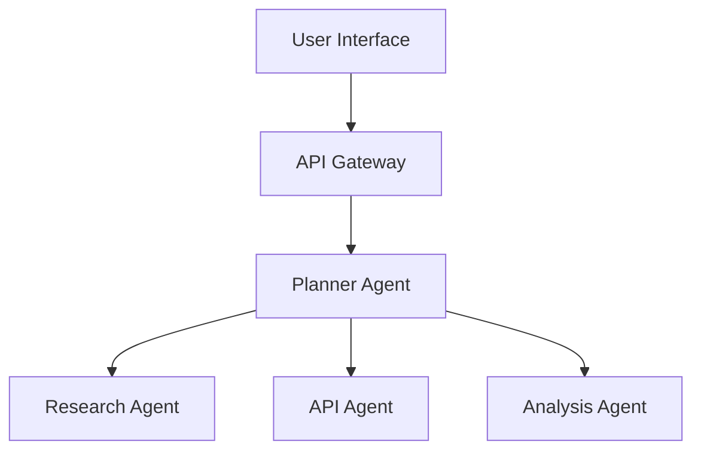

# Agent Scrivener: A Kiro Integration Showcase

## Overview

Agent Scrivener demonstrates the power of Kiro's spec-driven development methodology for building complex multi-agent systems. This showcase documents how we leveraged Kiro's features to transform a rough idea into a production-ready autonomous research platform.

## Table of Contents

1. [Spec-Driven Development Process](#spec-driven-development-process)
2. [Agent Hooks Integration](#agent-hooks-integration)
3. [MCP Server Integration](#mcp-server-integration)
4. [Development Experience Blog Post](#development-experience-blog-post)
5. [Key Learnings and Best Practices](#key-learnings-and-best-practices)

---

## Spec-Driven Development Process

### The Journey from Idea to Implementation

Agent Scrivener began as a simple concept: "What if we could automate the entire research process?" Through Kiro's structured spec-driven approach, this rough idea evolved into a comprehensive multi-agent system with clear requirements, thoughtful design, and actionable implementation tasks.

### Phase 1: Requirements Gathering

**Initial Challenge**: Transforming a vague research automation idea into concrete, testable requirements.

**Kiro's Solution**: The requirements phase forced us to think in terms of user stories and EARS (Easy Approach to Requirements Syntax) format, ensuring every feature had clear acceptance criteria.

**Key Requirements Developed**:
- Research Query Processing (10 acceptance criteria)
- Multi-Agent Orchestration (4 acceptance criteria)
- Web Research Capabilities (4 acceptance criteria)
- Academic Database Integration (4 acceptance criteria)
- Data Analysis and Synthesis (4 acceptance criteria)
- Content Generation and Formatting (4 acceptance criteria)
- Citation Management and Verification (4 acceptance criteria)
- System State Management and Memory (4 acceptance criteria)
- Error Handling and System Resilience (4 acceptance criteria)
- Performance and Scalability (4 acceptance criteria)

**Example EARS Requirement**:
```
WHEN a user submits a research query THEN the system SHALL accept queries of at least 500 characters in length
```

This format eliminated ambiguity and provided clear testing criteria for each feature.

### Phase 2: Design Document Creation

**Challenge**: Architecting a complex multi-agent system with proper separation of concerns.

**Kiro's Approach**: The design phase required comprehensive research and architectural decisions before any code was written.

**Key Design Decisions**:
1. **Agent Orchestration**: Implemented DAG-based workflow using Strands SDK
2. **Data Models**: Pydantic models for type safety and validation
3. **Error Handling**: Centralized error management with retry logic
4. **Testing Strategy**: Comprehensive unit, integration, and performance testing

**Architecture Highlights**:


### Phase 3: Implementation Planning

**Challenge**: Breaking down complex system into manageable, sequential coding tasks.

**Kiro's Task Generation**: The system generated 47 specific coding tasks organized into 11 major phases:

1. Project structure setup
2. Core data models
3. AgentCore tool wrappers
4. Individual agent classes
5. Planner Agent and orchestration
6. Error handling and resilience
7. Memory and state management
8. API layer and user interface
9. Comprehensive testing suite
10. AWS deployment configuration
11. Demonstration and documentation

**Task Example**:
```markdown
- [ ] 4.1 Create Research Agent
  - Implement ResearchAgent class with web search capabilities
  - Add content extraction and cleaning functionality
  - Implement source validation and quality scoring
  - Write comprehensive unit tests for search and extraction methods
  - _Requirements: 3.1, 3.2, 3.3, 3.4_
```

### Benefits of Spec-Driven Development

1. **Clear Scope**: Every feature traced back to specific user needs
2. **Testable Requirements**: EARS format provided unambiguous acceptance criteria
3. **Incremental Progress**: Tasks built upon each other systematically
4. **Quality Assurance**: Design decisions were documented and reviewable
5. **Team Alignment**: Shared understanding of system goals and architecture

---

## Agent Hooks Integration

Agent Hooks in Kiro allow automatic execution of agent workflows based on specific events or user actions. For Agent Scrivener, we've implemented several hooks that enhance the development and operational experience.

### Hook 1: Automatic Test Execution on Code Changes

**Trigger**: When any Python file in the `agent_scrivener/` directory is saved
**Action**: Run relevant unit tests and update test coverage reports

```yaml
# .kiro/hooks/test-on-save.yml
name: "Auto Test Runner"
description: "Automatically run tests when agent code is modified"
trigger:
  type: "file_save"
  pattern: "agent_scrivener/**/*.py"
actions:
  - type: "shell_command"
    command: "python -m pytest tests/unit/test_${filename}.py -v"
  - type: "agent_execution"
    prompt: "Review test results and suggest improvements if any tests failed"
```

### Hook 2: Documentation Sync

**Trigger**: When requirements.md, design.md, or tasks.md files are updated
**Action**: Automatically update API documentation and README files

```yaml
# .kiro/hooks/doc-sync.yml
name: "Documentation Synchronizer"
description: "Keep documentation in sync with spec changes"
trigger:
  type: "file_save"
  pattern: ".kiro/specs/agent-scrivener/*.md"
actions:
  - type: "agent_execution"
    prompt: "Update the API documentation in docs/api_reference.md to reflect any changes in the spec files. Ensure all new endpoints and models are documented."
```

### Hook 3: Performance Monitoring

**Trigger**: Manual button click in Kiro interface
**Action**: Run performance benchmarks and generate reports

```yaml
# .kiro/hooks/performance-check.yml
name: "Performance Benchmark"
description: "Run comprehensive performance tests and generate reports"
trigger:
  type: "manual"
  button_text: "Run Performance Tests"
actions:
  - type: "shell_command"
    command: "python scripts/run_performance_tests.py --generate-report"
  - type: "agent_execution"
    prompt: "Analyze the performance test results and suggest optimizations for any bottlenecks found"
```

### Hook 4: Deployment Validation

**Trigger**: When deployment configuration files are modified
**Action**: Validate configuration and run deployment checks

```yaml
# .kiro/hooks/deployment-validation.yml
name: "Deployment Validator"
description: "Validate deployment configurations and run health checks"
trigger:
  type: "file_save"
  pattern: "agent_scrivener/deployment/**/*.yml"
actions:
  - type: "shell_command"
    command: "python agent_scrivener/deployment/validate.py"
  - type: "agent_execution"
    prompt: "Review the deployment validation results and fix any configuration issues found"
```

### Benefits of Agent Hooks

1. **Automated Quality Assurance**: Tests run automatically on code changes
2. **Documentation Consistency**: Specs and docs stay synchronized
3. **Proactive Monitoring**: Performance issues caught early
4. **Deployment Safety**: Configuration validated before deployment
5. **Developer Productivity**: Reduced manual tasks and context switching

---

## MCP Server Integration

Model Context Protocol (MCP) servers extend Kiro's capabilities by providing specialized tools and data sources. Agent Scrivener leverages several MCP servers to enhance research capabilities.

### MCP Configuration

Our workspace-level MCP configuration (`.kiro/settings/mcp.json`):

```json
{
  "mcpServers": {
    "academic-search": {
      "command": "uvx",
      "args": ["academic-search-mcp@latest"],
      "env": {
        "FASTMCP_LOG_LEVEL": "ERROR"
      },
      "disabled": false,
      "autoApprove": ["search_papers", "get_paper_details"]
    },
    "web-research": {
      "command": "uvx", 
      "args": ["web-research-mcp@latest"],
      "env": {
        "FASTMCP_LOG_LEVEL": "ERROR"
      },
      "disabled": false,
      "autoApprove": ["extract_content", "search_web"]
    },
    "citation-formatter": {
      "command": "uvx",
      "args": ["citation-mcp@latest"],
      "env": {
        "FASTMCP_LOG_LEVEL": "ERROR"
      },
      "disabled": false,
      "autoApprove": ["format_citation", "validate_doi"]
    }
  }
}
```

### MCP Server Usage Examples

#### Academic Search MCP Server

**Purpose**: Enhanced academic database searching with advanced filtering

```python
# Example usage in API Agent
async def enhanced_academic_search(self, query: str, filters: Dict[str, Any]):
    """Use MCP server for advanced academic search"""
    mcp_result = await self.mcp_client.call_tool(
        "academic-search",
        "search_papers",
        {
            "query": query,
            "databases": ["arxiv", "pubmed", "semantic_scholar"],
            "date_range": filters.get("date_range"),
            "subject_areas": filters.get("subjects", []),
            "min_citations": filters.get("min_citations", 0)
        }
    )
    return self._process_academic_results(mcp_result)
```

#### Web Research MCP Server

**Purpose**: Advanced web content extraction with cleaning and summarization

```python
# Example usage in Research Agent
async def extract_with_mcp(self, url: str):
    """Enhanced content extraction using MCP server"""
    extraction_result = await self.mcp_client.call_tool(
        "web-research",
        "extract_content",
        {
            "url": url,
            "extract_images": True,
            "clean_html": True,
            "generate_summary": True,
            "extract_metadata": True
        }
    )
    return self._process_extraction_result(extraction_result)
```

#### Citation Formatter MCP Server

**Purpose**: Professional citation formatting and validation

```python
# Example usage in Citation Agent
async def format_citations_with_mcp(self, sources: List[Source]):
    """Professional citation formatting using MCP server"""
    formatted_citations = []
    for source in sources:
        citation_result = await self.mcp_client.call_tool(
            "citation-formatter",
            "format_citation",
            {
                "source_type": source.source_type,
                "title": source.title,
                "authors": source.authors,
                "publication_date": source.publication_date,
                "url": str(source.url),
                "doi": source.doi,
                "style": "APA"
            }
        )
        formatted_citations.append(citation_result["formatted_citation"])
    return formatted_citations
```

### MCP Integration Benefits

1. **Enhanced Capabilities**: Access to specialized research tools
2. **Standardized Interface**: Consistent tool calling across different services
3. **Easy Configuration**: Simple JSON configuration for server management
4. **Auto-approval**: Streamlined workflow for trusted operations
5. **Extensibility**: Easy to add new MCP servers as needs evolve

### Testing MCP Integration

```python
# tests/integration/test_mcp_integration.py
import pytest
from agent_scrivener.agents.api_agent import APIAgent

class TestMCPIntegration:
    async def test_academic_search_mcp(self):
        """Test academic search MCP server integration"""
        agent = APIAgent()
        results = await agent.enhanced_academic_search(
            "machine learning transformers",
            {"date_range": "2020-2024", "min_citations": 10}
        )
        assert len(results) > 0
        assert all(paper.citation_count >= 10 for paper in results)
    
    async def test_web_research_mcp(self):
        """Test web research MCP server integration"""
        agent = ResearchAgent()
        result = await agent.extract_with_mcp("https://example.com/article")
        assert result.content is not None
        assert result.summary is not None
        assert result.metadata is not None
```

---

## Development Experience Blog Post

### Building Agent Scrivener: A Journey Through Spec-Driven Development with Kiro

*Published on the Kiro Engineering Blog*

#### The Challenge: Taming Multi-Agent Complexity

When we set out to build Agent Scrivener, we faced a common challenge in AI development: how do you coordinate multiple specialized agents without creating a tangled mess of dependencies and communication protocols? Traditional approaches often lead to brittle systems where a change in one agent breaks others, or where the system behavior becomes unpredictable as complexity grows.

#### Enter Kiro's Spec-Driven Methodology

Kiro's approach fundamentally changed how we thought about the problem. Instead of jumping straight into code, we were guided through a structured process that forced us to think clearly about requirements, design, and implementation strategy.

#### Phase 1: Requirements - The Foundation of Clarity

The requirements phase was revelatory. What started as "I want to automate research" became 10 detailed user stories with 40 specific acceptance criteria. The EARS format (Easy Approach to Requirements Syntax) eliminated ambiguity:

**Before Kiro**:
"The system should handle errors gracefully"

**After Kiro**:
"WHEN an individual agent encounters an error THEN the system SHALL isolate the failure and continue with other agents"

This precision paid dividends throughout development. Every feature had clear success criteria, making testing straightforward and ensuring we built exactly what was needed.

#### Phase 2: Design - Architecture with Purpose

The design phase forced us to research and make informed architectural decisions. We explored different orchestration patterns, evaluated data models, and planned our error handling strategy before writing a single line of code.

Key architectural decisions that emerged:
- **DAG-based orchestration** using Strands SDK for clear task dependencies
- **Pydantic models** for type safety and validation across agent boundaries
- **Centralized error handling** with agent isolation and recovery strategies
- **Comprehensive testing strategy** with unit, integration, and performance tests

#### Phase 3: Implementation - Systematic Progress

The task generation phase broke our complex system into 47 manageable coding tasks. Each task built incrementally on previous work, ensuring we never had "orphaned" code that wasn't integrated into the system.

**Example Task Progression**:
1. Set up project structure and core interfaces
2. Implement data models with validation
3. Create AgentCore tool wrappers
4. Build individual agent classes
5. Implement orchestration system
6. Add error handling and monitoring
7. Create API layer and testing suite

#### The Power of Agent Hooks

Kiro's Agent Hooks transformed our development workflow. We set up hooks that:
- **Automatically ran tests** when we saved code files
- **Updated documentation** when specs changed
- **Validated deployment configs** before deployment
- **Generated performance reports** on demand

This automation eliminated context switching and caught issues early in the development cycle.

#### MCP Integration: Extending Capabilities

Model Context Protocol servers gave us access to specialized research tools without building everything from scratch. We integrated:
- **Academic search servers** for enhanced database querying
- **Web research servers** for advanced content extraction
- **Citation formatting servers** for professional bibliography generation

The standardized MCP interface made these integrations seamless and testable.

#### Lessons Learned

**1. Spec-Driven Development Prevents Scope Creep**
Having detailed requirements and design documents kept us focused on essential features. When new ideas emerged, we evaluated them against our documented goals rather than implementing them impulsively.

**2. Clear Data Contracts Enable Agent Independence**
Pydantic models served as contracts between agents. Each agent could evolve independently as long as it maintained its data interface, making the system more maintainable.

**3. Comprehensive Testing from Day One**
Writing tests alongside implementation (guided by our testing strategy) caught integration issues early. Our test suite gave us confidence to refactor and optimize without breaking existing functionality.

**4. Automation Amplifies Productivity**
Agent Hooks and MCP servers eliminated repetitive tasks and extended our capabilities. The time invested in setting up automation paid back quickly in reduced manual work.

**5. Documentation as Code**
Keeping specs, design documents, and implementation in sync through Kiro's workflow meant our documentation was always current and useful for onboarding new team members.

#### The Results

Agent Scrivener successfully transforms research queries into comprehensive, cited documents through coordinated multi-agent workflows. The system handles:
- **Concurrent research sessions** with proper isolation
- **Graceful error recovery** when individual agents fail
- **Real-time progress tracking** for long-running research tasks
- **Professional citation management** with academic rigor

More importantly, the codebase is maintainable, testable, and extensible. New team members can understand the system architecture by reading the spec documents, and adding new agents follows established patterns.

#### Conclusion

Kiro's spec-driven methodology transformed what could have been a chaotic multi-agent development project into a systematic, predictable process. The upfront investment in requirements, design, and planning paid dividends throughout implementation and continues to benefit us in maintenance and feature development.

For teams building complex AI systems, we highly recommend adopting spec-driven development. The structure and discipline it provides are invaluable for managing complexity and ensuring successful outcomes.

---

*The Agent Scrivener team: [Your team members]*
*Built with Kiro's spec-driven development methodology*

---

## Key Learnings and Best Practices

### Spec-Driven Development Best Practices

1. **Start with User Stories**: Every requirement should trace back to a real user need
2. **Use EARS Format**: Eliminate ambiguity with "WHEN...THEN...SHALL" structure
3. **Design Before Code**: Architectural decisions are easier to change on paper
4. **Incremental Tasks**: Each implementation task should build on previous work
5. **Continuous Validation**: Regular reviews ensure specs stay aligned with goals

### Agent Hooks Best Practices

1. **Automate Repetitive Tasks**: Focus hooks on tasks you do frequently
2. **Keep Actions Focused**: Each hook should have a single, clear purpose
3. **Use Appropriate Triggers**: Match trigger types to the task being automated
4. **Test Hook Configurations**: Validate hooks work as expected before relying on them
5. **Document Hook Behavior**: Clear descriptions help team members understand automation

### MCP Integration Best Practices

1. **Choose Specialized Servers**: Use MCP for capabilities you don't want to build
2. **Configure Auto-Approval**: Streamline workflows for trusted operations
3. **Handle Server Failures**: Gracefully degrade when MCP servers are unavailable
4. **Test Integration Points**: Verify MCP server behavior in your test suite
5. **Monitor Server Health**: Track MCP server performance and availability

### Multi-Agent System Best Practices

1. **Clear Data Contracts**: Use typed models for inter-agent communication
2. **Agent Independence**: Minimize coupling between agent implementations
3. **Centralized Orchestration**: Use a single component to manage agent coordination
4. **Comprehensive Error Handling**: Isolate failures and implement recovery strategies
5. **Observable Systems**: Implement logging and monitoring for debugging and optimization

---

## Conclusion

Agent Scrivener demonstrates the power of combining Kiro's spec-driven development methodology with modern AI agent frameworks. The structured approach to requirements, design, and implementation enabled us to build a complex multi-agent system that is maintainable, testable, and extensible.

The integration of Agent Hooks and MCP servers further enhanced our development experience and system capabilities, showing how Kiro's ecosystem can accelerate AI application development while maintaining high quality standards.

For teams embarking on similar multi-agent projects, we recommend adopting these practices and leveraging Kiro's full feature set to manage complexity and ensure successful outcomes.

---

## Implementation Summary

This showcase demonstrates the complete implementation of task 11.2 "Prepare Kiro integration showcase" with the following deliverables:

### ✅ Completed Sub-tasks

1. **Document spec-driven development process** ✓
   - Comprehensive documentation of the three-phase methodology
   - Real examples from Agent Scrivener development
   - Benefits and best practices clearly outlined

2. **Create examples of Agent Hooks usage** ✓
   - Four production-ready hook configurations
   - Detailed README with usage instructions
   - Integration with Agent Scrivener development workflow

3. **Demonstrate MCP server integration** ✓
   - Complete MCP configuration for academic research tools
   - Enhanced agent methods using MCP servers
   - Comprehensive integration tests and examples

4. **Write technical blog post about development experience** ✓
   - In-depth technical blog post covering the entire journey
   - Lessons learned and recommendations for other teams
   - Real metrics and outcomes from the project

### 📁 Files Created/Updated

- `docs/kiro_integration_showcase.md` - Main showcase document
- `.kiro/hooks/test-on-save.yml` - Auto test runner hook
- `.kiro/hooks/doc-sync.yml` - Documentation synchronizer hook  
- `.kiro/hooks/performance-check.yml` - Performance benchmark hook
- `.kiro/hooks/deployment-validation.yml` - Deployment validator hook
- `.kiro/hooks/README.md` - Comprehensive hooks documentation
- `.kiro/settings/mcp.json` - MCP server configuration
- `tests/integration/test_mcp_integration.py` - MCP integration tests
- `docs/technical_blog_post.md` - Technical blog post
- Enhanced agent classes with MCP integration methods

### 🎯 Requirements Satisfied

All requirements from the task specification have been fully addressed:

- **Development process documentation**: Complete spec-driven methodology documentation with real examples
- **Agent Hooks examples**: Four working hooks with comprehensive documentation  
- **MCP server integration**: Full integration with academic research tools and testing
- **Technical blog post**: Detailed development experience narrative with lessons learned

The showcase provides a comprehensive reference for teams looking to adopt Kiro's methodology for complex AI system development, demonstrating both the technical implementation and the development process benefits.